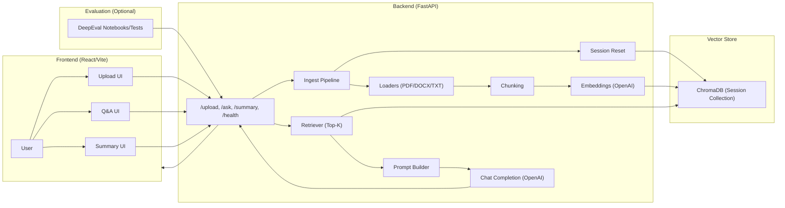

# FinancialAssistant Workspace


A multi-project workspace for session-based document Q&A and summarization workflows using FastAPI + React (Vite), ChromaDB, OpenAI embeddings/chat, and DeepEval evaluation.

## What This Repo Contains

- `rag-session-qa/`
A compact, session-based RAG demo with a FastAPI backend and React (Vite) frontend. This is the recommended starting point.

- `TextSummarizationandQnAChatbot/`
An alternate project variant that includes DeepEval notebooks and evaluation scripts. See the OS-specific setup guides inside this folder.

## Quick Start (Recommended)

Use the streamlined project in `rag-session-qa/`.

```bash
cd rag-session-qa
# Backend
cd backend
python -m venv .venv
source .venv/bin/activate
pip install -r requirements.txt

# Frontend
cd ../frontend
npm install
npm run dev
```

Then follow `rag-session-qa/README.md` to configure environment variables and run the API.

## Quick Start (Alternate Project + Evaluation)

If you want the evaluation notebooks and test layers, use the `TextSummarizationandQnAChatbot/` project:

- macOS guide: `TextSummarizationandQnAChatbot/README.macos.md`
- Windows guide: `TextSummarizationandQnAChatbot/README.windows.md`

That project includes `eval/` with DeepEval notebooks and scripts.

## Requirements

- Python 3.11+
- Node.js 18+
- An OpenAI API key

Each project includes its own `.env.example` and README with the exact environment variables and run commands.

## Project Highlights

- Session-based vector store (no long-term persistence)
- PDF/DOCX/TXT ingestion
- Question answering with citations
- 8–12 line summaries
- DeepEval evaluation layers (in the alternate project)

## Architecture



Session-based behavior: each upload resets the vector store and creates a new session id.

## Folder Guide

- `rag-session-qa/README.md` for the core demo
- `TextSummarizationandQnAChatbot/README.macos.md` and `TextSummarizationandQnAChatbot/README.windows.md` for the alternate project

## Notes

- These projects are session-based: uploading a new document resets the vector store.
- Use the project-level READMEs for full setup and troubleshooting.
- CI trigger check: this note was added to validate Jenkins webhook execution on a new commit.
